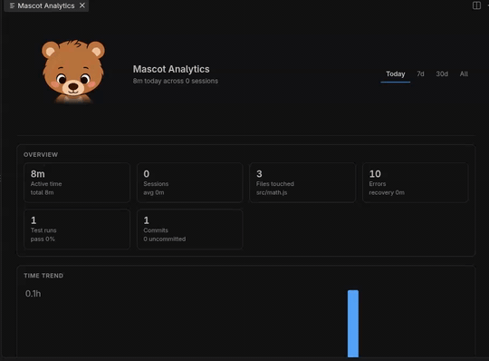
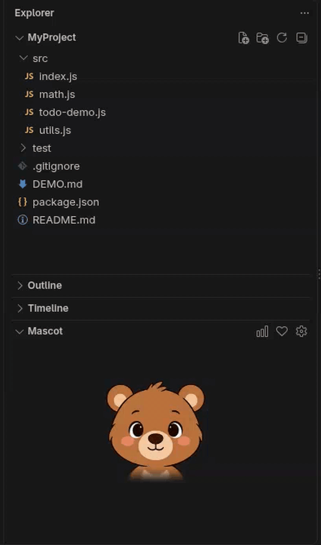
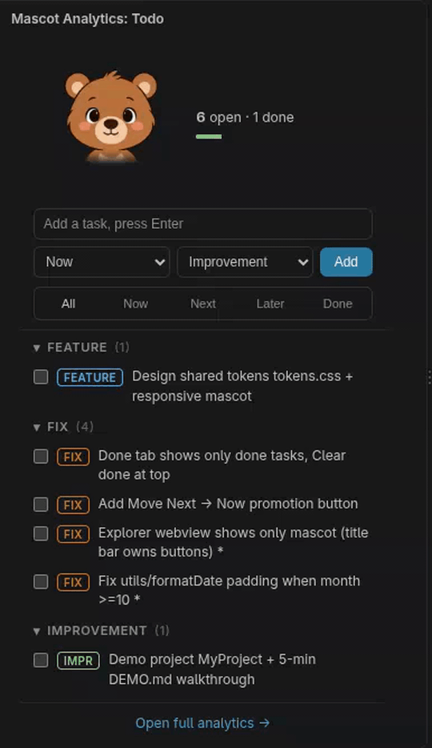
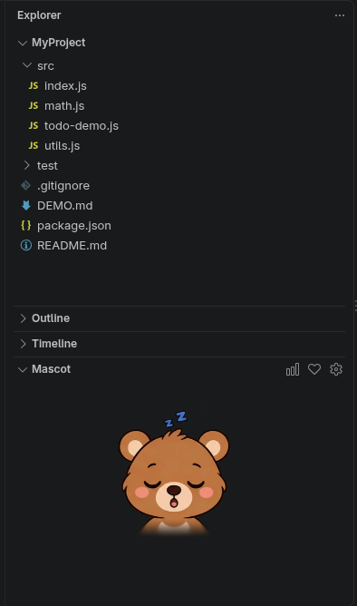
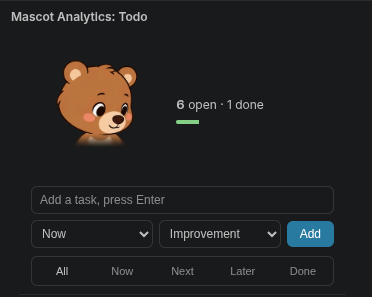
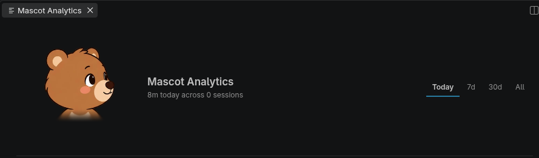

# Taskyy — Cute Pet Mascot for Devs

A calm pet companion for your workspace: 21 animals, a simple todo list, and local time analytics. It stays quiet while you code.

[⬇ Install from the VS Code Marketplace](https://marketplace.visualstudio.com/items?itemName=achraaflaamari.taskyy)

## What you get

Three views, one pet:

| View | Where | What it does |
| --- | --- | --- |
| **Mascot** | Explorer (bottom) | Your companion. Watches your pointer, reacts to errors, terminal results, commits and saves. Click to boop. Sleeps when idle. |
| **Todo** | Activity Bar | A small task list: `This session / Next up / Someday`, with `Feature / Fix / Improvement` labels, notes, deadlines, and a `Done` tab. |
| **Analytics** | Editor tab | Your coding stats: active time, sessions, files, tests, errors, commits, tasks. Four ranges: `Today / 7d / 30d / All`. |

## Mascot

- 21 animals (fox, cat, bunny…) and 3 sizes (Small 96, Medium 140, Large 200 px).
- Follows your pointer inside its view, sleeps after 5 minutes idle — click to wake.
- Title-bar buttons: `graph` opens Analytics, `heart` boops, `gear` opens Settings.

## Todo

- Add with **Enter**, click a row for notes, deadline, and move/delete.
- Filter with `All / Now / Next / Later / Done`. `Done` has **Clear done** at the top.
- When `Now` is empty, `Move Next → Now` appears to pull the next task forward.
- Checking a task celebrates on every surface (`starstruck` + “Done.”).

## Analytics

- 12 sections: active time, sessions, files, hotspots, tests, errors, commits, tasks, and more.
- Everything is estimated from local activity and labelled as such.
- Open it from the Mascot title bar (`graph` icon) or with `Mascot: Open Analytics`.

## Get started

1. Install from the [Marketplace](https://marketplace.visualstudio.com/items?itemName=achraaflaamari.taskyy), or `code --install-extension taskyy-0.5.0.vsix`, then **Reload Window**.
2. Explorer → **Mascot** is at the bottom.
3. Activity Bar → **Taskyy Todo** (keep it ≥ 280 px wide).
4. Click the `graph` icon (or run `Mascot: Open Analytics`) for the full dashboard.

## Settings

All settings live under `mascot.*` (Settings UI → Extensions → Mascot):

| Setting | Default | What it does |
| --- | --- | --- |
| `mascot.enabled` | `true` | Show the companion. |
| `mascot.characterId` | `"fox"` | One of the 21 animals. |
| `mascot.size` | `140` | Size in px (64–320). Presets: 96 / 140 / 200. |
| `mascot.clickReaction` | `true` | Boop animation on click. |
| `mascot.autoReaction` | `true` | Ambient faces when idle (drowsy at 30 s, asleep at 5 min). |
| `mascot.followPointer` | `true` | The pet follows the pointer inside its views. |
| `mascot.reactToErrors` | `true` | React when errors appear or clear. |
| `mascot.reactToTerminal` | `true` | React to terminal command results. |
| `mascot.breakReminderMinutes` | `0` | Nudge after N minutes without a break (`0` = off). |
| `mascot.analytics.enabled` | `true` | Master switch for tracking. Off stops everything. |
| `mascot.analytics.idleSeconds` | `120` | Seconds idle before time stops counting (min 30). |
| `mascot.analytics.trackFiles` | `true` | Store per-file time. Off stores folder hotspots only. |
| `mascot.analytics.retentionDays` | `365` | Days of stats to keep (min 7). |

Commands (`Ctrl+Shift+P` → `Mascot: …`): `Boop` · `Open Settings` · `Select Character` · `Set Size` · `Toggle Behaviour` · `Open Analytics` · `Reset Project Stats` · `Clear Completed Todos`.

> Formerly named **Mascot** — existing `mascot.*` settings keep working.

## Privacy

100% local. No network, no telemetry, no account.

- Stats and todos live in `workspaceState` (`stats:v1:*`, `todos:v1:list`) — per project, survives restarts.
- Only relative file paths and timings are stored. Never code content, terminal output, or file contents.
- `Mascot: Reset Project Stats` deletes all stats for the workspace.

## Credits

- Mascot art and interaction model: [page-mascot](https://github.com/nilbuild/page-mascot) by [Kamran Ahmed](https://kamran.fyi), MIT. The 21 animal sprite atlases are bundled in `media/mascots/`. See [LICENSE](LICENSE) for the full third-party notice.
- Demo: [koboyo.com/page-mascot](https://koboyo.com/page-mascot).

## License

MIT — see [LICENSE](LICENSE).

[Issues](https://github.com/achraaflaamari/Taskyy/issues)
